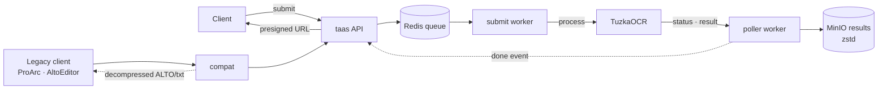

# tuzka-as-a-service (taas)

**Tuzka as a Service** — an async OCR gateway in front of the
[TuzkaOCR](https://github.com/moravianlibrary/TuzkaOCR) engine. It provides a
REST + WebSocket API, a job queue with multi-backend dispatch, result storage,
and a legacy-PERO compatibility layer for existing clients (ProArc, AltoEditor).



The Python package / CLI is named `taas`.

## Documentation

- [`app/`](app/README.md) — core server: API, workers, job lifecycle
- [`clients/`](clients/README.md) — Python & Java client libraries
- [`compat/`](compat/README.md) — legacy PERO-compatibility server

## Components

| Service | Role |
|---|---|
| `api` | REST + WebSocket API (jobs, admin, dashboard) — published on `:8080` |
| `worker-submit` | pulls queued jobs, dispatches to a healthy OCR backend |
| `worker-poller` | polls engine job status, harvests + stores results |
| `worker-cleanup` | TTL cleanup of buckets and old DB rows |
| `compat` | legacy PERO-style API → taas — published on `:8001` |
| `ocr-engine` | the TuzkaOCR engine (built from `./TuzkaOCR`) |
| postgres / redis / minio-incoming / minio-results | infrastructure |

## Prerequisites

- Docker + Docker Compose
- The TuzkaOCR engine source at `./TuzkaOCR` (it's **not** vendored in this repo):

  ```bash
  git clone https://github.com/moravianlibrary/TuzkaOCR.git TuzkaOCR
  ```

## Quickstart

```bash
make env        # create .env + .env.app from templates (generates a Fernet key)
make up         # build + start the whole stack (first run is slow: TuzkaOCR model load)
make test       # end-to-end: submit an image -> OCR -> fetch + preview the ALTO result
```

Dashboard: <http://localhost:8080/dashboard> (master key from `.env.app`).

> The shipped `MASTER_KEY` and generated `KEY_ENCRYPTION_SECRET` are for local
> development. **Change them for any real deployment.**

## Configuration

Each runnable piece reads its own env file; copy the matching `*.example`:

| File | Used by | Notes |
|---|---|---|
| `.env` | `docker compose` interpolation + postgres/minio/ocr containers | infra creds only |
| `.env.app` | `api` + workers (via `env_file:`) | every `app/config.Settings` field, in-cluster hostnames |
| `.env.local` | local `uvicorn` dev | same keys, `localhost` hostnames |
| `compat/.env.compat` | local compat dev | compat-only settings |

Live env files are git-ignored; only the `*.example` templates are tracked.

## Testing

```bash
make test                       # full stack, default fmt=multi
FMT=alto make test              # single-format run (works today)
make test-fast                  # against an already-running stack (no rebuild)
make test-compat                # legacy-compat server end-to-end
```

`scripts/test.sh` saves each decompressed result under `test-data/out/` and
prints a preview — the ALTO XML and the OCR text extracted from it. Controls:
`IMAGE=`, `FMT=` (`alto`|`txt`|`multi`), `SHOW_RESULT=0`, `PREVIEW_LINES=`.

> `fmt=multi` (alto **and** txt from one request) requires engine-side support;
> until then use `FMT=alto` / `FMT=txt`.

## Local development (without containers)

```bash
make infra                                  # postgres + redis + minio in Docker
pip install -e .                            # taas + deps
alembic upgrade head
cp .env.local.example .env.local            # adjust if needed
uvicorn app.main:app --reload --port 8080
```

## Make targets

Run `make help` for the full list (`up`, `down`, `clean`, `logs`, `ps`, `seed`,
`test`, `test-compat`, `env`, `secret`, …).
