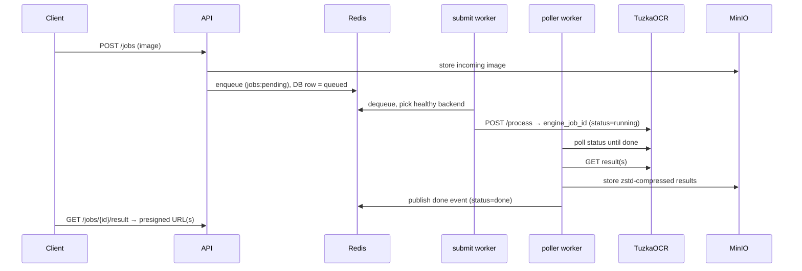

# `app/` — taas core server

The FastAPI application and background workers that make up **Tuzka as a Service**:
the public API, the job queue lifecycle, result storage, and the admin dashboard.
For the project overview and quickstart, see the [root README](../README.md).

## Layout

| Path | Responsibility |
|---|---|
| `main.py` | app factory (`create_app`), router wiring, `/healthz`, `/dashboard`, `/static` |
| `config.py` | `Settings` (pydantic-settings) — read from `.env.local` / container env |
| `deps.py` | FastAPI dependencies: DB session, Redis, auth (`require_user` / `require_master`), rate limiters |
| `models/` | SQLAlchemy models — `user`, `job` (+ `JobResult`), `backend`, `storage_config`, `db` |
| `schemas/` | Pydantic request/response schemas |
| `routers/` | HTTP/WebSocket endpoints — `jobs`, `admin`, `dashboard`, `ws` |
| `services/` | `auth`, `storage` (MinIO), `redis_jobs` (queue/state), `engine_client` (TuzkaOCR HTTP) |
| `workers/` | standalone processes — `submit`, `poller`, `cleanup` |
| `static/` | dashboard UI (`index.html`, `dashboard.js`, `style.css`) |

## Authentication

| Header | Used by | Identifies |
|---|---|---|
| `X-API-Key` | `/api/v1/*`, `/ws` | a user (hashed key looked up in `users`) |
| `X-Master-Key` | `/admin/*`, `/dashboard/*` | the operator (matches `MASTER_KEY`) |

## API

Interactive OpenAPI docs are served at <http://localhost:8080/docs> (Swagger UI),
<http://localhost:8080/redoc> (ReDoc), and <http://localhost:8080/openapi.json> (raw schema).

### Jobs — `/api/v1` (user key, rate-limited)

| Method | Path | Notes |
|---|---|---|
| `POST` | `/jobs` | multipart: `image` (required), `uuid` (required — caller's `external_id`, must be a valid UUID, unique per user), `fmt` (`alto`\|`txt`\|`multi`, default `multi`), `domain?` → `202 {job_id, external_id, status}` |
| `GET` | `/jobs/{job_id}` | job status |
| `GET` | `/jobs/{job_id}/result` | `{results:[{fmt, url}]}` — presigned URLs (public endpoint, regenerated if expired) |
| `GET` | `/jobs/{job_id}/result/{fmt}/download` | stream the stored artifact through taas (internal endpoint; for callers that can't reach the public presign host, e.g. compat) |
| `GET` | `/jobs?status=&limit=&offset=` | paginated list (scoped to the user) |

### Admin — `/admin` (master key)

`GET/POST /users`, `DELETE /users/{u}` (deactivate), `POST /users/{u}/rotate-key`,
`PUT /users/{u}/key`, `GET/POST /backends`, `PATCH /backends/{id}` (incl. enable/disable),
`GET/PUT /storage-config`. Creating/rotating a user returns the raw `api_key` **once**.

### Dashboard — `/dashboard` (master key)

`GET /stats`, `GET /users`, `GET /jobs` (filters: `username`, `status`, `from`, `to`,
`limit`, `offset`), `GET /backends` (live inflight + health). The HTML page is at `GET /dashboard`.

### WebSocket — `/ws?api_key=...`

On connect: replays `done`/`failed` jobs finished within `WS_CATCH_UP_SECONDS`, then streams
live events. Event JSON:

```json
{"status": "done", "uuid": "<external_id>", "alto_url": "...", "txt_url": "..."}
{"status": "failed", "uuid": "<external_id>", "error": "..."}
```

## Job lifecycle



Statuses: `queued → running → done` (or `failed`).

## Workers

Each runs as its own process (one container per worker in compose):

```bash
python -m app.workers.submit    # dequeue → dispatch to a healthy backend
python -m app.workers.poller    # poll engine status → harvest + store results → publish events
python -m app.workers.cleanup   # reaper (every ~60s) + TTL cleanup of buckets and old DB rows (~10 min)
```

The cleanup worker also runs a **reaper** every ~60s: jobs stuck in `queued` past
`jobs.queued_timeout_seconds` (default 900) or `running` past
`jobs.running_timeout_seconds` (default 300) are marked `failed`, their backend slot
released, and a WS `failed` event emitted. These timeouts and the presigned-URL window
(`presigned.ttl_minutes`, default 60) live in the DB `config` table (editable via
`PUT /admin/config` and the dashboard). The Redis job-state TTL is computed as
`queued + running + 60s`.

**Job-record retention is hardcoded to 30 days** (`RETENTION_DAYS` in
`app/workers/cleanup.py`) — it is *not* operator-tunable. On its heavy sweep the
cleanup worker rolls each whole day that has aged past 30 days into the permanent
`job_daily_stats` table (per `day × username × engine_version × domain`: counts plus
the processing-time distribution — avg/stddev/min/max and exact p50/p95/p99) and then
deletes the raw `jobs`/`job_results` rows. The rollup is one advisory-locked
transaction with `ON CONFLICT DO NOTHING`, so it is safe to re-run. Aggregated stats
are kept forever and downloadable as CSV via `GET /dashboard/stats.csv?year=`.

## Running

Containers (with the rest of the stack): see the [root README](../README.md) (`make up`).

Locally:

```bash
make infra                     # postgres + redis + minio in Docker
pip install -e "..[api]"       # taas + web/api deps (workers need only `..`)
alembic upgrade head           # apply migrations (config in ../alembic)
cp ../.env.local.example ../.env.local
uvicorn app.main:app --reload --port 8080
# workers, in separate shells:
python -m app.workers.submit & python -m app.workers.poller & python -m app.workers.cleanup
```

Configuration keys are documented in `../.env.app.example`.
