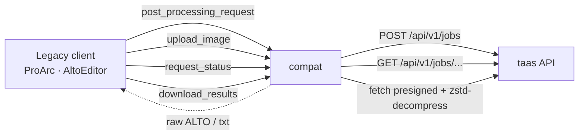

# `compat/` — legacy PERO-compatibility server

A thin adapter that exposes the **legacy PERO-OCR HTTP API** (as used by ProArc and
AltoEditor) and translates it to the taas API, so existing clients work unchanged.
It is a separate FastAPI service (published on `:8001`); see the
[root README](../README.md) for the whole stack.

## How it works



- A *request* groups one or more page filenames; compat tracks it in Redis
  (`compat:{request_id}` + per-file job IDs, expiring after `COMPAT_TTL_SECONDS`).
- `upload_image` forwards each page to taas `POST /api/v1/jobs` (with the request's engine
  `domain` and `fmt`) and remembers the returned `job_id`.
- `download_results` fetches the taas presigned URL **server-side**, decompresses the zstd
  payload, and returns raw ALTO XML or plain text — so the legacy client gets the bytes directly.

## Authentication

Clients send the legacy `api-key` header. compat forwards it to taas as `X-API-Key`, so
**the legacy api-key is just a taas user key** (created via `POST /admin/users`).

## Endpoints

All require the `api-key` header.

| Method | Path | Purpose |
|---|---|---|
| `GET` | `/get_engines` | list configured engines → `{label: {id, description}}` |
| `POST` | `/post_processing_request` | start a request — body `{engine, images:{filename:…}}` → `{request_id}` |
| `GET` | `/get_status?request_id=` | request exists check |
| `POST` | `/upload_image/{request_id}/{filename}` | multipart `file` → forwarded to taas |
| `GET` | `/request_status/{request_id}` | per-file `{state}` — `WAITING` \| `PROCESSING` \| `PROCESSED` |
| `GET` | `/download_results/{request_id}/{filename}/{format}` | `format` = `alto` (XML) or anything else (text) |

## Configuration

Read from `compat/app/config.Settings` (env / `compat/.env.compat` for local dev; the
container is configured via the `environment:` block in `docker-compose.yml`).

| Setting | Default | Notes |
|---|---|---|
| `TAAS_BASE_URL` | `http://api:8000` | base URL of the taas API |
| `REDIS_URL` | `redis://redis:6379/0` | request/job-id tracking |
| `COMPAT_TTL_SECONDS` | `3600` | how long request state lives |
| `ENGINES` | `{1: Default, 2: kramarky}` | JSON map `id → {domain, label, description}`; `domain` is passed through to taas |

## Layout

| Path | Role |
|---|---|
| `app/main.py` | app factory + lifespan (httpx client to taas, Redis) |
| `app/routers/legacy.py` | the legacy endpoints above |
| `app/state.py` | `CompatState` — Redis-backed request/job-id tracking |
| `app/config.py` | `Settings` (incl. `ENGINES`) |

## Running & testing

Part of the stack via `make up`. End-to-end test:

```bash
make test-compat        # post_processing_request → upload → status → download ALTO
```

> `upload_image` requests `fmt=multi` from taas (both ALTO + text), which depends on
> engine-side multi support. Until then the compat download path is exercised with a
> single format — see `scripts/test-compat.sh`.
