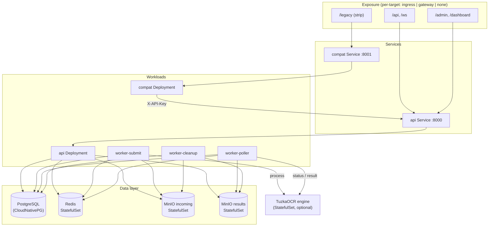
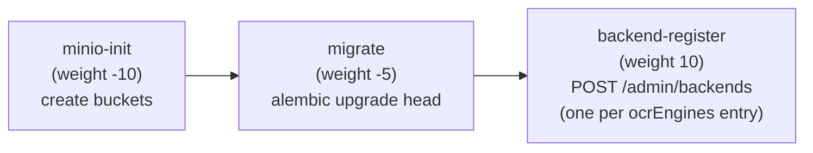
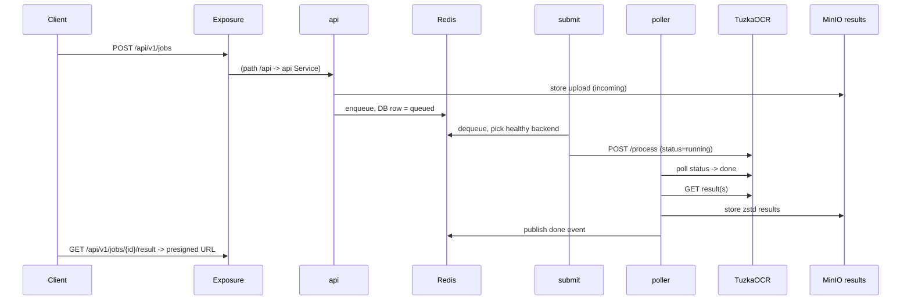

# taas on Kubernetes — Architecture

How the Helm chart wires the stack together. For chart usage and values, see
[README.md](README.md); for the application itself, see the
[repo docs](../../../README.md).

## Topology

## Configuration & secrets

- **`<release>-config`** ConfigMap — non-secret app settings (`REDIS_URL`, `MINIO_*_URL`,
  bucket names, rate limits, worker ticks, …). Mounted into api + workers via `envFrom`.
- **`<release>-secret`** Secret — `DATABASE_URL` (assembled from `cnpg.*` + the Postgres
  password), `MASTER_KEY`, `KEY_ENCRYPTION_SECRET`, MinIO access/secret keys, and the OCR
  engine key. Also `envFrom` into api + workers; MinIO and the engine consume their keys
  via `secretKeyRef`.
- **`<release>-cnpg-auth`** Secret — Postgres owner credentials for CloudNativePG.
- Compat has its own `<release>-compat-config` (`TAAS_BASE_URL`, `REDIS_URL`,
  `COMPAT_TTL_SECONDS`, `ENGINES`); it never sees the app secret — it forwards the caller's
  `api-key`.

## Install / upgrade hooks

Run in weight order on `post-install` / `post-upgrade`:

Jobs use `backoffLimit` + readiness retries so they tolerate the DB / MinIO / API not being
ready the instant the hook starts. Until `migrate` completes, the API and workers may log
errors and retry (tables not yet present) — this is transient.

## Request lifecycle (in-cluster)

The legacy path is identical but enters through `compat` (`/legacy/*`, prefix stripped),
which translates the PERO API to the taas API and returns decompressed ALTO/text directly.

## Scaling & state

| Concern | Approach |
|---|---|
| Stateless tier | api, workers, compat — scale via `replicaCount` (workers per type) |
| Queue / pub-sub | single Redis StatefulSet (1 replica) with a PVC |
| Database | CloudNativePG `Cluster` (`cnpg.instances` for HA) |
| Object storage | two single-node MinIO StatefulSets (incoming / results) |
| OCR engine | optional StatefulSet; or register external backends via the admin API |

> The bundled Redis / MinIO are single-replica. For production-grade HA, point the app at a
> managed Redis and S3-compatible storage (set `config`/`secrets` accordingly) and treat the
> in-chart ones as a dev/default convenience.
